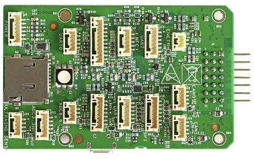

# NXP RDDRONE-FMUK66 FMU

RDDRONE-FMUK66 FMU ....




## Quick Summary

- **Main FMU Processor:** ...
- **IO Processor: STM32F100:** ...
- **On-board sensors:**
  * Accel/Gyro: ...
  * Accel/Gyro: ...
  * Magnetometer: ...
 

Additional information can be found in the [Technical Data Sheet](xxxx).


## Purchase

[Purchae Link]


## Connectors

[Connector Diagram]

## Pinouts

[Pinouts listing or link]

## Dimensions

[Dimensions]


## Assembly/Setup

[Usually a link to a Quick Start Doc]


## Building Firmware

> **Tip** Most users will not need to build this firmware!
  It is pre-built and automatically installed by *QGroundControl* when appropriate hardware is connected.

To [build PX4](https://dev.px4.io/master/en/setup/building_px4.html) for this target:
```
make XXXXXX
```


## Debug Port

The system's serial console and SWD interface runs on the **FMU Debug** port, while the I/O console and SWD interface can be accessed via **I/O Debug** port.
In order to access these ports, the user must ...

[I know you have docs for this, just a sentence above and then a link will be fine]


## Peripherals

* [List of anything people should use with this hardware]


## Supported Platforms / Airframes

Any multicopter / airplane / rover or boat that can be controlled with normal RC servos or Futaba S-Bus servos. The complete set of supported configurations can be seen in the [Airframes Reference](../airframes/airframe_reference.md).


## Further info

- ]
